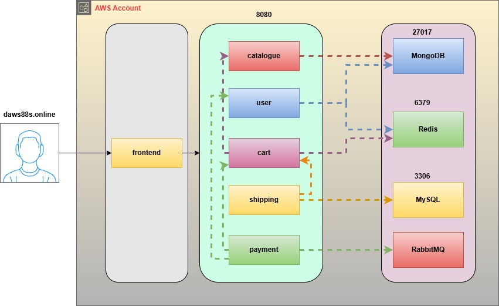

# Roboshop 3 Tier Architecture

## Services & Ports

| Service | Port | Technology |
|---------|------|------------|
| Frontend | 80 | Nginx |
| Catalogue | 8080 | NodeJS |
| User | 8080 | NodeJS |
| Cart | 8080 | NodeJS |
| Shipping | 8080 | Java/Maven |
| Payment | 8080 | Python |
| Dispatch | - | GoLang (consumer only) |
| MongoDB | 27017 | NoSQL Database |
| Redis | 6379 | In-memory Cache |
| MySQL | 3306 | SQL Database |
| RabbitMQ | 5672 | Message Queue |

## Security Groups

> **Legend:**
> 🟡 SSH &nbsp;&nbsp; 🔴 Public Internet &nbsp;&nbsp; 🔵 Internal (Security Group)

---

### roboshop-frontend

| # | Port | Protocol | Source | Description |
|---|------|----------|--------|-------------|
| 🟡 | 22 | TCP | MY-IP/32 | SSH access |
| 🔴 | 80 | TCP | 0.0.0.0/0 | HTTP from internet |

---

### roboshop-catalogue

| # | Port | Protocol | Source | Description |
|---|------|----------|--------|-------------|
| 🟡 | 22 | TCP | MY-IP/32 | SSH access |
| 🔵 | 8080 | TCP | roboshop-frontend | Frontend reverse proxy |
| 🔵 | 8080 | TCP | roboshop-cart | Cart service lookup |

---

### roboshop-user

| # | Port | Protocol | Source | Description |
|---|------|----------|--------|-------------|
| 🟡 | 22 | TCP | MY-IP/32 | SSH access |
| 🔵 | 8080 | TCP | roboshop-frontend | Frontend reverse proxy |
| 🔵 | 8080 | TCP | roboshop-payment | Payment user verification |

---

### roboshop-cart

| # | Port | Protocol | Source | Description |
|---|------|----------|--------|-------------|
| 🟡 | 22 | TCP | MY-IP/32 | SSH access |
| 🔵 | 8080 | TCP | roboshop-frontend | Frontend reverse proxy |
| 🔵 | 8080 | TCP | roboshop-shipping | Shipping cart lookup |
| 🔵 | 8080 | TCP | roboshop-payment | Payment cart lookup |

---

### roboshop-shipping

| # | Port | Protocol | Source | Description |
|---|------|----------|--------|-------------|
| 🟡 | 22 | TCP | MY-IP/32 | SSH access |
| 🔵 | 8080 | TCP | roboshop-frontend | Frontend reverse proxy |

---

### roboshop-payment

| # | Port | Protocol | Source | Description |
|---|------|----------|--------|-------------|
| 🟡 | 22 | TCP | MY-IP/32 | SSH access |
| 🔵 | 8080 | TCP | roboshop-frontend | Frontend reverse proxy |

---

### roboshop-dispatch

| # | Port | Protocol | Source | Description |
|---|------|----------|--------|-------------|
| 🟡 | 22 | TCP | MY-IP/32 | SSH access |

> Dispatch is a RabbitMQ consumer — it makes outbound connections only, no inbound ports required.

---

### roboshop-mongodb

| # | Port | Protocol | Source | Description |
|---|------|----------|--------|-------------|
| 🟡 | 22 | TCP | MY-IP/32 | SSH access |
| 🔵 | 27017 | TCP | roboshop-catalogue | Catalogue reads product data |
| 🔵 | 27017 | TCP | roboshop-user | User reads/writes user accounts |

---

### roboshop-redis

| # | Port | Protocol | Source | Description |
|---|------|----------|--------|-------------|
| 🟡 | 22 | TCP | MY-IP/32 | SSH access |
| 🔵 | 6379 | TCP | roboshop-user | User session caching |
| 🔵 | 6379 | TCP | roboshop-cart | Cart data caching |

---

### roboshop-mysql

| # | Port | Protocol | Source | Description |
|---|------|----------|--------|-------------|
| 🟡 | 22 | TCP | MY-IP/32 | SSH access |
| 🔵 | 3306 | TCP | roboshop-shipping | Shipping reads city/distance data |

---

### roboshop-rabbitmq

| # | Port | Protocol | Source | Description |
|---|------|----------|--------|-------------|
| 🟡 | 22 | TCP | MY-IP/32 | SSH access |
| 🔵 | 5672 | TCP | roboshop-payment | Payment publishes order messages |
| 🔵 | 5672 | TCP | roboshop-dispatch | Dispatch consumes order messages |

---

